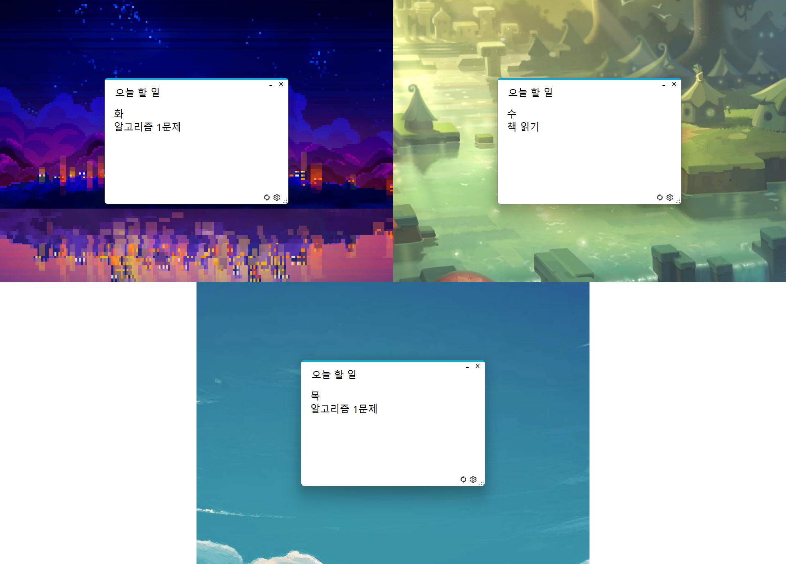
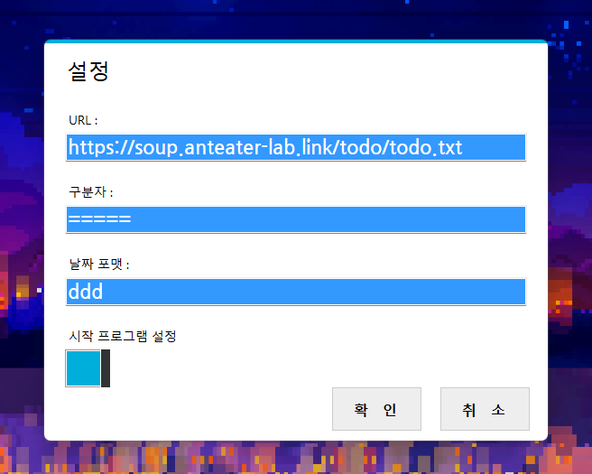

<h1 align="center">오늘 할 일</h1>
 

  

from 2018

  (이 저장소는 기존 <a href="https://github.com/anteater333/Anteater_lab/tree/master/Anteater_Releases/%EC%98%A4%EB%8A%98%ED%95%A0%EC%9D%BC" target="_blank">개인 코드 저장소</a>에서 복사되었습니다.)

 

<h1 align="center">오늘 뭐 하려 했더라🤔</h1>

  
  <!-- 이미지 수정 예정 -->

 

<h1 align="center">⚙️</h1>

  

 

<h1 align="center">Contacts</h1>

<a href="https://github.com/anteater333">https://github.com/anteater333</a>

<a href="mailto:anteater1056@gmail.com">anteater1056@gmail.com</a>

